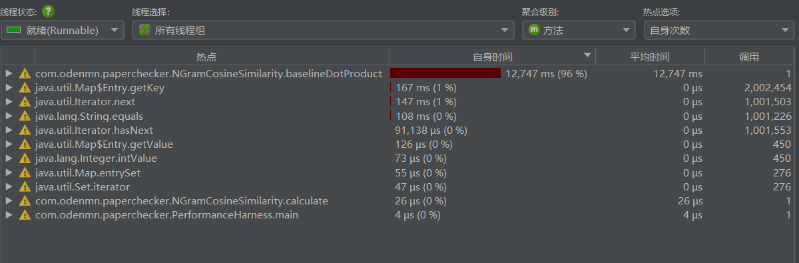
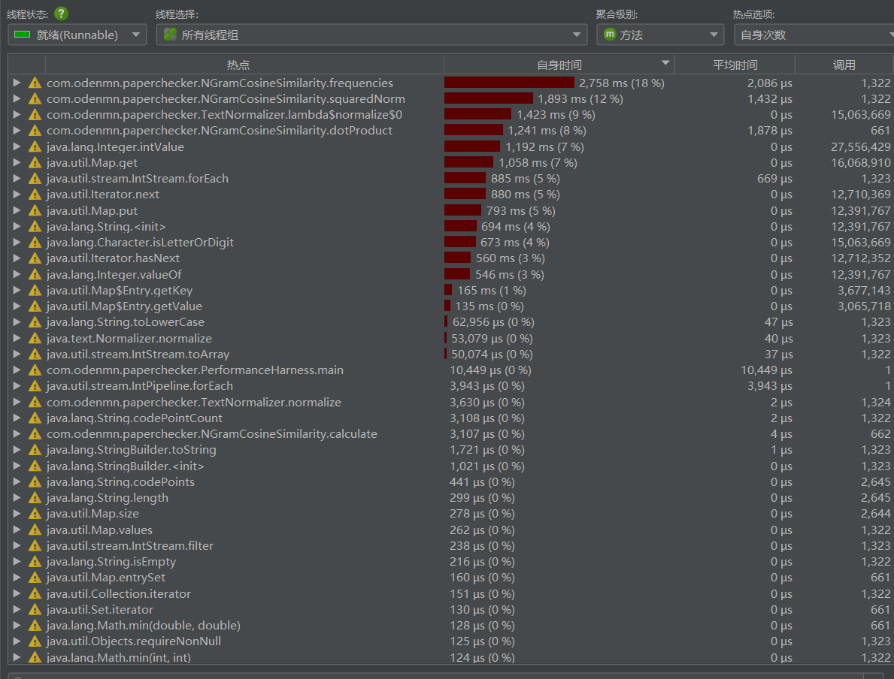
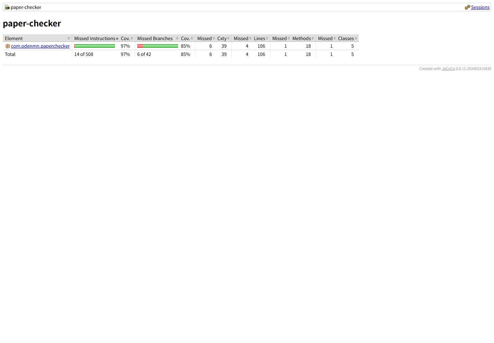

[GitHub仓库地址：https://github.com/odenmn/3124004070](https://github.com/odenmn/3124004070)

|  |  |
| --- | --- |
| **这个作业属于哪个课程** | [软件工程课程](https://edu.cnblogs.com/campus/gdgy/Class56-Grade2024-CS) |
| 这个作业要求在哪里 | [第一次个人编程作业要求](https://edu.cnblogs.com/campus/gdgy/Class56-Grade2024-CS/homework/15693) |
| 这个作业的目标 | 完成个人编程任务 |

# 第一次个人编程作业

## 一、PSP 表格

编码开始前完成预估，实际耗时按本次开发过程中的有效工作时间记录。阶段小计不与其子项重复累计。

| PSP2.1 | Personal Software Process Stages | 预估耗时（分钟） | 实际耗时（分钟） |
| --- | --- | ---: | ---: |
| Planning | 计划 | 30 | 32 |
| · Estimate | · 估计任务所需时间 | 30 | 18 |
| Development | 开发 | 350 | 186 |
| · Analysis | · 需求分析（包括学习新技术） | 60 | 32 |
| · Design Spec | · 生成设计文档 | 45 | 18 |
| · Design Review | · 设计复审 | 20 | 9 |
| · Coding Standard | · 代码规范 | 20 | 8 |
| · Design | · 具体设计 | 60 | 19 |
| · Coding | · 具体编码 | 160 | 37 |
| · Code Review | · 代码复审 | 45 | 13 |
| · Test | · 测试、自我测试和修改 | 140 | 50 |
| Reporting | 报告 | 180 | 34 |
| · Test Report | · 测试报告 | 60 | 15 |
| · Size Measurement | · 计算工作量 | 20 | 5 |
| · Postmortem & Process Improvement Plan | · 事后总结与改进计划 | 100 | 14 |
| Total | 合计 | 560 | 252 |

## 二、计算模块接口的设计与实现

### 2.1 模块划分

项目使用 Java 语言和 Maven 构建，编译目标为 Java 8。核心代码按单一职责拆分为 5 个类：

| 类 | 职责 |
| --- | --- |
| `Main` | 程序入口，调用应用服务并根据结果返回退出码 |
| `PaperCheckerApplication` | 校验三个命令行参数，协调读取、计算和写出 |
| `Utf8FileService` | 以严格 UTF-8 读取输入，仅写入参数指定的答案文件 |
| `TextNormalizer` | 执行 NFKC、大小写归一化，过滤标点、符号和空白 |
| `NGramCosineSimilarity` | 构造字符二元组频次向量并计算余弦相似度 |

模块调用流程如下：

```text
三个绝对路径
     │
     ▼
参数数量、路径合法性与输入输出冲突检查
     │
     ▼
严格 UTF-8 读取两个输入文件
     │
     ▼
NFKC 规范化 → 保留字母与数字 → 提取字符二元组
     │
     ▼
构造频次向量 → 计算余弦相似度 → 限制到 [0, 1]
     │
     ▼
按 Locale.ROOT 格式化为两位小数并写入答案文件
```

### 2.2 关键函数接口

各个类通过职责明确的小函数协作，关键函数如下：

| 所属类 | 函数接口 | 输入与输出 | 主要职责 |
| --- | --- | --- | --- |
| `Main` | `main(String[] args)` | 输入三个命令行参数，无返回值 | 创建应用对象，并根据执行结果设置进程退出码 |
| `PaperCheckerApplication` | `run(String[] args, PrintStream errorStream)` | 输入路径参数和错误流，返回退出码 | 串联参数校验、文件读取、相似度计算和答案写出 |
| `PaperCheckerApplication` | `toAbsolutePath(String rawPath, String argumentName)` | 输入路径字符串，返回规范化的 `Path` | 拒绝空路径和相对路径，保证符合评测接口 |
| `PaperCheckerApplication` | `ensureDistinctAnswerPath(Path originalPath, Path suspiciousPath, Path answerPath)` | 输入三个路径，无返回值 | 防止答案文件覆盖任一输入文件 |
| `Utf8FileService` | `read(Path path)` | 输入文件路径，返回文本 | 检查文件存在性，并使用严格 UTF-8 解码 |
| `Utf8FileService` | `write(Path path, String content)` | 输入答案路径和内容，无返回值 | 创建或覆盖答案文件并写入 UTF-8 文本 |
| `TextNormalizer` | `normalize(String text)` | 输入原始文本，返回规范化文本 | 执行 NFKC、统一大小写并过滤非字母数字字符 |
| `NGramCosineSimilarity` | `calculate(String original, String suspicious)` | 输入两段文本，返回 `double` | 处理边界情况，构造频次向量并计算最终相似度 |
| `NGramCosineSimilarity` | `frequencies(String text, int nGramSize)` | 输入文本和 N 值，返回频次表 | 按 Unicode 码点提取 N 元组并统计出现次数 |
| `NGramCosineSimilarity` | `dotProduct(Map<String, Integer> left, Map<String, Integer> right)` | 输入两个频次向量，返回点积 | 遍历较小向量，通过哈希查找高效计算共同特征 |
| `NGramCosineSimilarity` | `squaredNorm(Map<String, Integer> frequencies)` | 输入频次向量，返回模长平方 | 累加各特征频次的平方，为余弦公式计算模长 |

其中，`run` 是命令行应用的流程入口，`calculate` 是计算模块对外提供的核心接口。函数调用关系为：

```text
Main.main
└─ PaperCheckerApplication.run
   ├─ toAbsolutePath / ensureDistinctAnswerPath
   ├─ Utf8FileService.read
   ├─ NGramCosineSimilarity.calculate
   │  ├─ TextNormalizer.normalize
   │  ├─ frequencies
   │  ├─ dotProduct
   │  └─ squaredNorm
   └─ Utf8FileService.write
```

`calculate` 的核心处理逻辑如下。该接口隐藏了文本清洗和向量计算细节，调用者只需要传入两段文本：

```text
calculate(original, suspicious)
├─ 分别调用 normalize 规范化两段文本
├─ 处理空文本和完全相同文本
├─ 根据较短文本长度确定使用一元组或二元组
├─ 分别调用 frequencies 构造频次向量
├─ 调用 dotProduct 计算两个向量的点积
├─ 调用 squaredNorm 计算两个向量的模长平方
└─ 代入余弦公式，并将结果限制到 [0, 1]
```

真正需要其他模块调用的只有 `calculate`，其余私有函数用于分解复杂度，便于代码复审和性能定位。

### 2.3 算法设计

我使用字符 N-gram 与余弦相似度完成查重。分词算法依赖词典，不同词典可能产生不同结果；字符二元组不需要网络或外部模型，更适合评测机的离线环境。

设规范化文本的二元组频次向量分别为 `A` 和 `B`，相似度为：

```text
similarity = (A · B) / (||A|| × ||B||)
```

计算过程包括：

1. 使用 Unicode NFKC 统一全角/半角字符，并统一拉丁字母大小写。
2. 去除标点、空白和符号，减少排版差异造成的影响。
3. 按 Unicode code point 提取相邻两个字符，避免把代理对拆开。
4. 使用 `HashMap<String, Integer>` 统计每个二元组出现次数。
5. 计算两个频次向量的点积和模长，得到 `[0, 1]` 内的结果。

相同文本直接返回 `1.0`；两个规范化后均为空的文本返回 `1.0`；只有一方为空时返回 `0.0`；不足两个字符时自动退化为一元组。这样可避免除零和短文本无特征的问题。

## 三、计算模块性能分析与改进

### 3.1 分析方法

使用 JProfiler 15.0.3 的 CPU Sampling 模式，采样间隔为 5 ms。输入固定为 `orig.txt` 和 `orig_0.8_add.txt`。吞吐量基准测试中每个版本持续运行约 25 秒；CPU 分析时先预留 5 秒供分析器连接，再连续采样约 15 秒。

首版的 `baselineDotProduct` 使用双层循环比较两张特征表。若两个文本分别有 `U`、`V` 个不同二元组，点积阶段复杂度为 `O(U × V)`。JProfiler 的 Hot Spots 视图显示该函数是计算模块的主要热点。

在优化前的采样结果中，`baselineDotProduct` 的自身耗时为 12,747 ms，占总采样时间的 96%。这说明运行时间几乎全部消耗在双层循环点积计算上，优化该函数能够获得最直接的性能收益。



### 3.2 优化方案

优化后只遍历较小的特征表，并在较大的 `HashMap` 中直接查找相同二元组：

```java
Map<String, Integer> smaller = left.size() <= right.size() ? left : right;
Map<String, Integer> larger = left.size() <= right.size() ? right : left;
for (Map.Entry<String, Integer> entry : smaller.entrySet()) {
    Integer matchingFrequency = larger.get(entry.getKey());
    if (matchingFrequency != null) {
        product += (double) entry.getValue() * matchingFrequency;
    }
}
```

点积阶段平均复杂度降为 `O(min(U, V))`，额外空间复杂度没有增加。

| 版本 | 运行时间 | 完成次数 | 吞吐量 |
| --- | ---: | ---: | ---: |
| 首版 | 25.090 秒 | 242 | 9.65 次/秒 |
| 优化版 | 25.001 秒 | 17103 | 684.08 次/秒 |

优化后吞吐量约为首版的 70.89 倍，两版对有效样例的输出均为 `0.90`，说明优化没有改变计算结果。

优化后的连续采样共完成约 662 次相似度计算。Hot Spots 中，`frequencies`、`squaredNorm` 和 `dotProduct` 的自身耗时分别为 2,758 ms、1,893 ms 和 1,241 ms，占比分别约为 18%、12% 和 8%。原先由双层循环造成的单一热点已经消除，计算耗时主要分布在频次向量构造、模长计算和文本规范化上。



性能分析和优化共计约 35 分钟，JProfiler 截图和分析记录已随项目保存，便于复查。

## 四、单元测试与覆盖率

项目使用 JUnit 5 编写了 21 个测试，采用等价类、边界值和白盒分支覆盖方法。主要测试思路如下：

| 类别 | 测试场景 |
| --- | --- |
| 正常情况 | 相同中文、部分二元组重合、重复特征计权、完全不同文本 |
| 规范化 | 标点和空白、英文大小写、全角半角字符 |
| 边界情况 | 双方为空、单方为空、单字符、空参数数组 |
| 参数异常 | 参数数量错误、空路径、相对路径、答案路径覆盖输入 |
| 文件异常 | 输入不存在、非法 UTF-8、答案目录不存在 |
| 端到端 | 三个绝对路径运行并输出两位小数 |

部分算法测试代码如下：

```java
@Test
void partialBigramOverlapHasExpectedCosine() {
    assertEquals(2.0 / 3.0,
            calculator.calculate("abcd", "abce"), TOLERANCE);
}

@Test
void twoEmptyNormalizedTextsHaveFullSimilarity() {
    assertEquals(1.0,
            calculator.calculate("，。！", " \r\n"), TOLERANCE);
}
```

运行 `mvnw.cmd clean verify` 后，21 个测试全部通过。JaCoCo 最终统计为：行覆盖率 96.23%，分支覆盖率 85.71%，超过项目设置的 80% 分支覆盖率质量门槛。



## 五、异常处理说明

程序不输出堆栈到答案文件，错误信息只写到标准错误流，并使用非零退出码表示失败。

| 异常场景 | 设计目标 | 对应单元测试 |
| --- | --- | --- |
| 参数不是 3 个 | 防止数组越界，提示标准命令格式 | `wrongArgumentCountPrintsUsageAndDoesNotWriteFile` |
| 路径为空或不是绝对路径 | 保证与评测接口一致，避免依赖当前目录 | `emptyPathIsRejected`、`relativeInputPathIsRejected` |
| 答案路径与输入相同 | 防止写答案时破坏论文原文 | `answerCannotOverwriteAnInputFile` |
| 输入文件不存在 | 给出明确文件错误，不生成虚假答案 | `missingInputFileReturnsFileError` |
| 输入不是合法 UTF-8 | 防止静默替换乱码后得到错误重复率 | `malformedUtf8ReturnsFileError` |
| 输出目录不存在或不可写 | 以文件错误结束，避免异常退出 | `missingOutputDirectoryReturnsFileError` |
| 规范化后文本为空 | 明确定义相似度并避免除零 | `twoEmptyNormalizedTextsHaveFullSimilarity` |

例如，输入文件不存在时，`Utf8FileService` 会抛出带文件路径的 `IOException`，应用层捕获后输出 `File error:` 并返回退出码 3；测试同时验证答案文件没有被创建。

## 六、代码质量与最终验证

项目在 Maven `verify` 阶段自动执行质量检查：

- Checkstyle：0 项违规；
- SpotBugs（Max effort、Low threshold）：0 错误、0 警告；
- `javac -Xlint`：除 JDK 对旧目标版本的工具链提示外，所有代码警告均按错误处理；
- 最终 JAR 的 class major version 为 52，可在 Java 8 及以上版本运行；
- 样例命令冷启动约 160 ms，答案为 `0.90`，满足 5 秒和两位小数要求。

项目规模为 5 个生产代码文件、249 行生产代码，以及 3 个测试/性能文件、256 行测试代码，共计 505 行 Java 代码。

运行方式：

```text
java -jar main.jar [原文绝对路径] [抄袭版绝对路径] [答案文件绝对路径]
```

## 七、项目总结

本次作业让我体会到，查重算法不仅要给出一个相似度数字，还要考虑输入编码、Unicode 字符、边界情况、复杂度和可测试性。首版功能正确，但 JProfiler 显示双层循环无法适应长文本；将算法改为哈希查找后，在保持输出一致的前提下获得了明显提升。

不足之处是字符二元组主要描述局部字面特征，对大规模同义改写和语义级抄袭识别能力有限。后续可研究加入词级特征、停用词和语义向量，同时使用更多不同类型的真实语料重新校准权重。

## 附录：本地提交记录

```text
项目：初始化论文查重工程
功能：实现论文查重首版
测试：补充单元测试与质量检查配置
性能：优化特征向量点积计算
文档：完善作业报告与发布说明
文档：补充代码中文注释
文档：展示计算模块关键函数
文档：补充性能分析截图
文档：补充作业信息表
```
